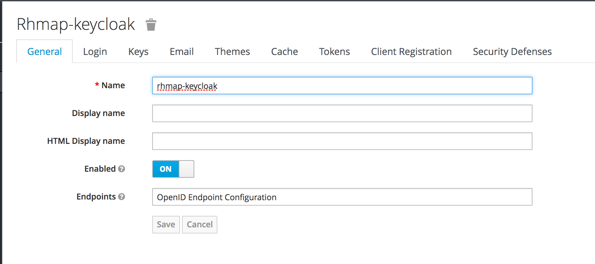
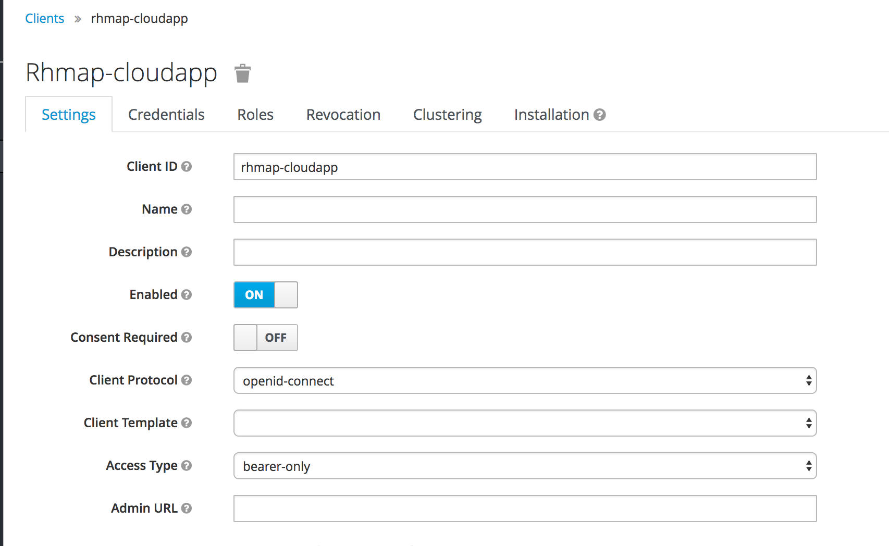
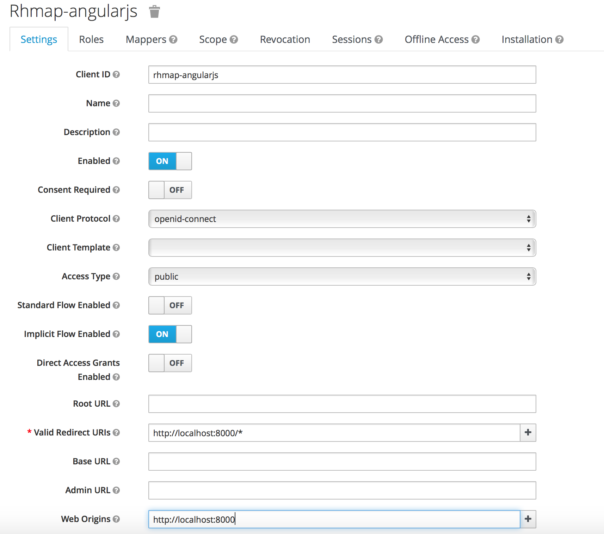
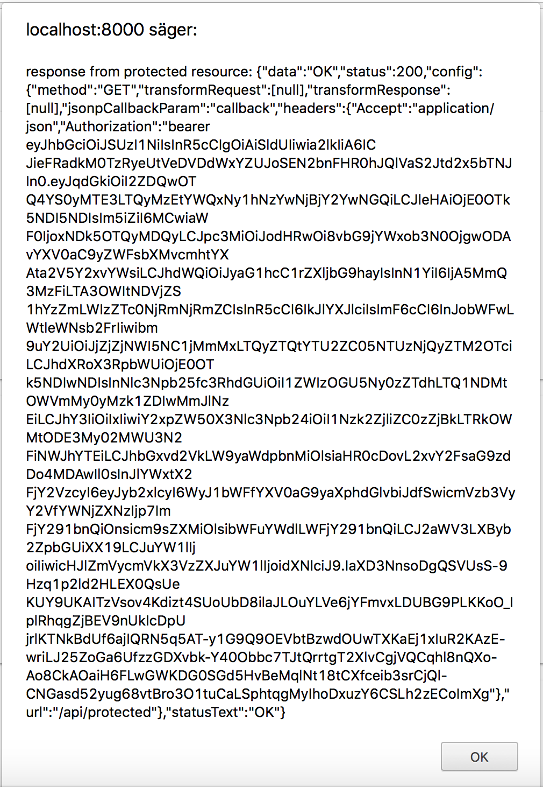

# rhmap-keycloak
This demo shows how to use RHSSO (Keycloak) for authenticating to an AngularJS app.
It also shows how to protect a CloudApp with RHSSO.

## Preparation
In order for the demo to work, the following steps need to be taken:
1. Install RHSSO 7.1.1 and create a realm
2. Create a RHSSO client for the CloudApp
3. Create a RHSSO client for the AngularJS application and create an application user
4. Download and install the Nodejs and Javascript Keycloak adapters

### Install RHSSO 7.1.1
```
1. Download and install RHSSO 7.1.1
(https://access.redhat.com/jbossnetwork/restricted/listSoftware.html?downloadType=distributions&product=core.service.rhsso) (https://keycloak.gitbooks.io/documentation/content/server_installation/topics/installation.html)
2. Login as admin to RHSSO (e.g. http://localhost:8080)
3. Create realm (e.g. rhmap-keycloak)
```



### Create a RHSSO client for the CloudApp
```
1. In the rhmap-keycloak realm, create a CloudApp client (e.g. rhmap-cloudapp)
2. In Settings, select `Access-Type: bearer-only`
3. Go to Installation
4. Select `Keycloak OIDC JSON` as Format
5. Download `keycloak.json` and store next to `application.js` (your CloudApp)
```



### Create a RHSSO client for the AngularJS application
```
1. In the rhmap-keycloak realm, create an AngularJS app client (e.g. rhmap-angular)
2. In Settings, select `Access-Type: public`
3. Go to Installation
4. Select `Keycloak OIDC JSON` as Format
5. Download `keycloak.json` and store in the app's public folder
6. In Settings, set up a valid redirect URI (e.g. https://localhost:8000/*)
7. In Settings, set up Web Origins (e.g. https://localhost:8000). This is necessary for CORS.
8. Go to the Users menu in RHSSO and add a user which will be used for logging in to the AngularJS app
```



### Download and install Keycloak adapters
```
1. Download and install Keycloak nodejs adapter 7.1.1 (https://access.redhat.com/jbossnetwork/restricted/listSoftware.html?downloadType=distributions&product=core.service.rhsso) or use `npm install keycloak-connect`
2. Download Keycloak Javascript adapter 7.1.1
3. Unzip and place under public/lib in your app directory
```

## Running the CloudApp
```
1. Install grunt `npm install grunt --save-dev`
2. Install grunt packages:
`npm install grunt-contrib-jshint --save-dev`
`npm install grunt-contrib-watch --save-dev`
`npm install grunt-env --save-dev`
`npm install grunt-nodemon --save-dev`
`npm install grunt-ng-constant --save-dev`
3. Run the CloudApp with `grunt` or `grunt serve:local`
```
This will start the CloudApp on `localhost:8000`. You can verify that it works by opening a browser and try to access `http://localhost:8000/api/ping`. You should see "pong" as a response.

The CloudApp also contains an API method that is protected by RHSSO:

```
app.get('/api/protected', keycloak.protect(), function (req, res) {
```

A simple test that RHSSO can be reached by the Keycloak Nodejs adapter is to open a browser and try to access `localhost:8000/api/protected`. You should see an Access Denied message.

Calling this method from the AngularJS app will require that an Access Token is passed in a header.

## Adding RHSSO to the AngularJS app
The AngularJS app can use RHSSO to authenticate the user before making REST calls to the
Cloud App. Note that the app needs to be bootstrapped manually in order to prevent
constant reloading due to the redirect sent back from RHSSO after authentication.

```
<script>
angular.element(document).ready(() => {
  window._keycloak = Keycloak();

  window._keycloak
    .init({
      onLoad: 'login-required'
    })
    .success(() => {
      angular.bootstrap(document, ['rhmap-keycloak']); // manually bootstrap Angular app
    });
});
</script>
```

The `_keycloak`variable can be accessed by other modules by injecting a service:

```
angular
    .module('auth', ['ui.router'])
    .service('authService', ['$window',
    function($window) {

    return $window._keycloak;
}]);
```

When calling a protected resource in the Cloud App, the Authorization header must be added:

When the CloudApp runs locally:
```
$http.get('/api/protected',
{headers:{'Accept': 'application/json', 'Authorization': 'bearer ' + authService.token}});
```

When the CloudApp runs on RHMAP:
```
FHCloud.get('/api/protected', {headers:{'Accept': 'application/json', 'Authorization': 'bearer ' + authService.token}});
```

## Running the demo
Start the CloudApp locally with `grunt serve:local` or just `grunt`.
Open a browser at the location of your CloudApp, e.g. http://localhost:8000
If you haven't authenticated to RHSSO a login prompt served from RHSSO will be shown
After logging in with the user you created in RHSSO you will be able to access the AngularJS App
The app will immediately try to access the protected CloudApp resource `/api/protected` using the Access Token provided by the Javascript Keycloak adapter. If everything works you should see an Alert box containing "Response from protected resource, data:"OK", status: 200 and the Access Token.



## Deploying to RHMAP
Note that the RHSSO server must be accessible from the internet in order for the CloudApp
running on RHMAP to be able to access it.
The `auth-server-url`in keycloak.json for both the CloudApp and the AngularJS app needs to be
changed to the server and port where RHSSO is running.

To deploy the CloudApp on RHMAP do the following steps:
```
1. In App Studio go to Projects then choose Import.
2. Create New Project
3. Select Empty Project
4. Select App Type = Cloud App
5. Import from public git repo and use the link to this repo: https://github.com/torbjorndahlen/rhmap-keycloak.git
6. Go to the CloudApp's Editor menu and open the file `rhmap-keycloak/public/js/util/config.js`
7. Change the line `.constant('ENV', {name:'local',apiEndpoint:'http://localhost:8000'})` to `.constant('ENV', {name:'remote',apiEndpoint:''})` and save the file
8. Create a connection tag which requires a Client App. Simply go to Projects and create a Hello World App in the project.
9. Go to Connections and create a new Connection
10. Select Configure and copy everything in the JSON object into the file `fhconfig` which is located under `rhmap-keycloak/public`.
11. Deploy the Cloud App
12. Use the link to the Cloud App to access the mobile app
```

## Troubleshooting

### No "Access-Control-Allow-Origin"
If you're seeing No "Access-Control-Allow-Origin" in the browsers web console when the AngularJS app
tries to authenticate to RHSSO (look for requests to http://localhost:8080/auth/realms/rhmap-keycloak),
you should ensure you have added the AngularJS app as Web Origin when creating a client for AngularJS in RHSSO.

### Test for access tokens
Using curl to obtain an access token:

```
$ RESULT=`curl --data "grant_type=password&client_id=rhmap-keycloak&username=user&password=password" http://localhost:8080/auth/realms/rhmap-keycloak/protocol/openid-connect/token`

$ echo $RESULT

$ TOKEN=`echo $RESULT | sed 's/.*access_token":"//g' | sed 's/".*//g'`

$ curl http://localhost:8000/api/protected -H "Authorization: bearer $TOKEN"
```
First we authenticate with our realm in RHSSO. Note that Direct-Access-Grants must be enabled in the Realm Settings in order to authenticate with username and password parameters.
Next we parse out the access token and stores it in the TOKEN variable.
Finally we call the Cloud App's protected resource with the access token.
